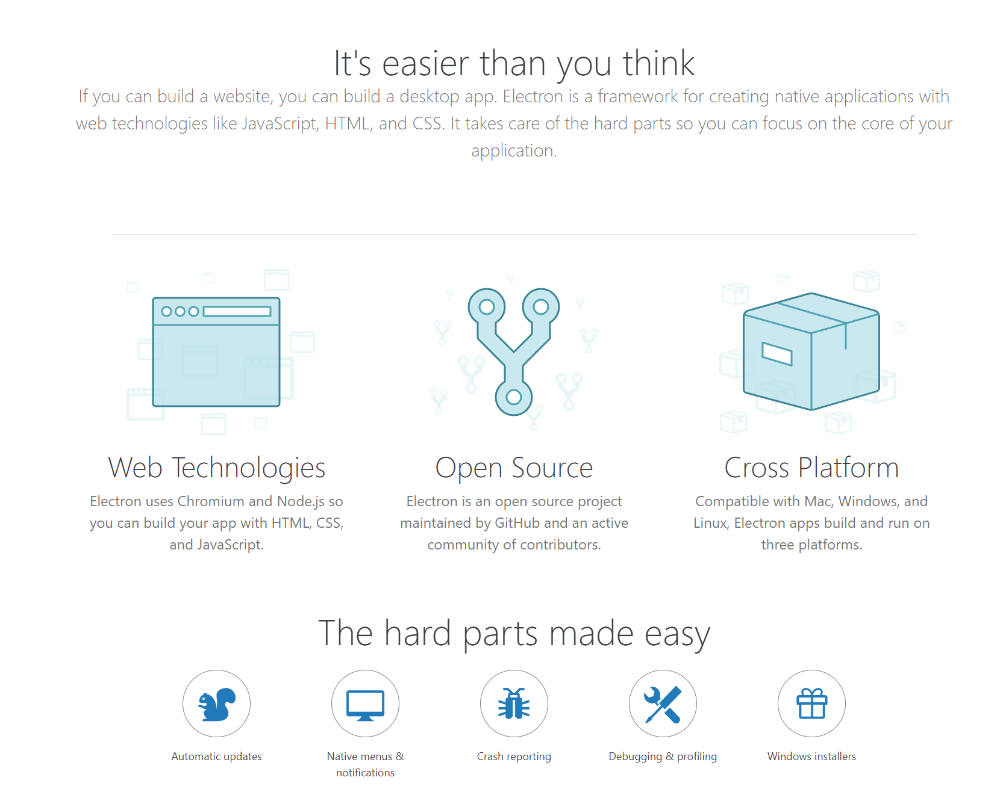
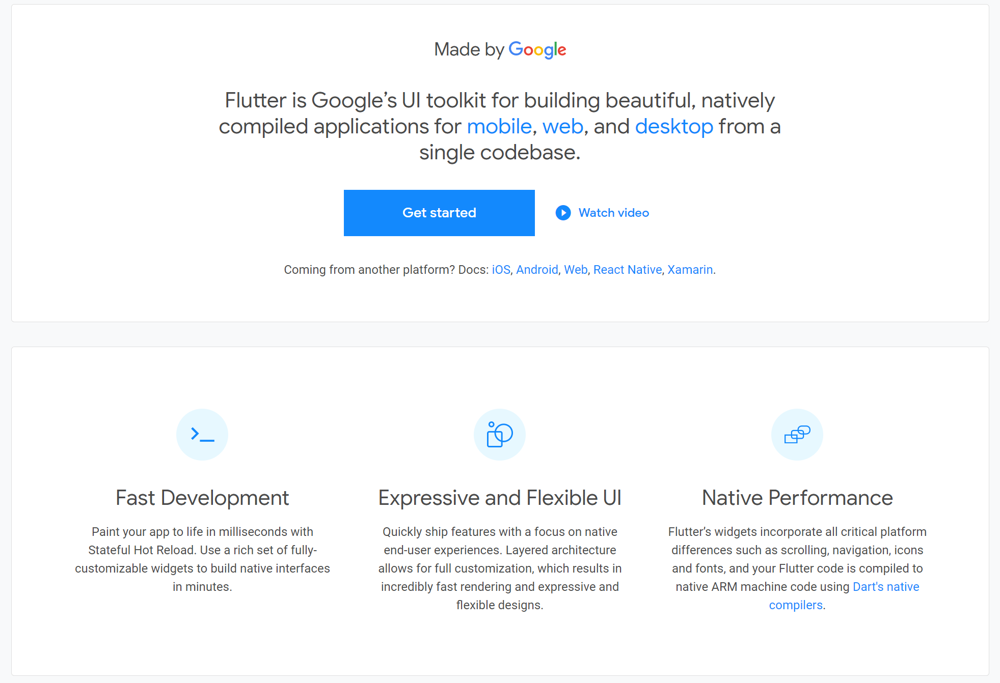
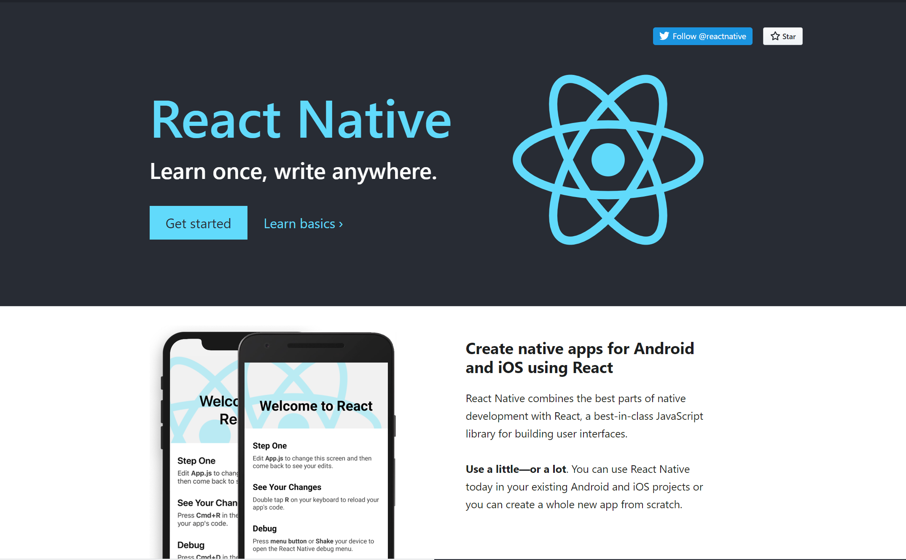
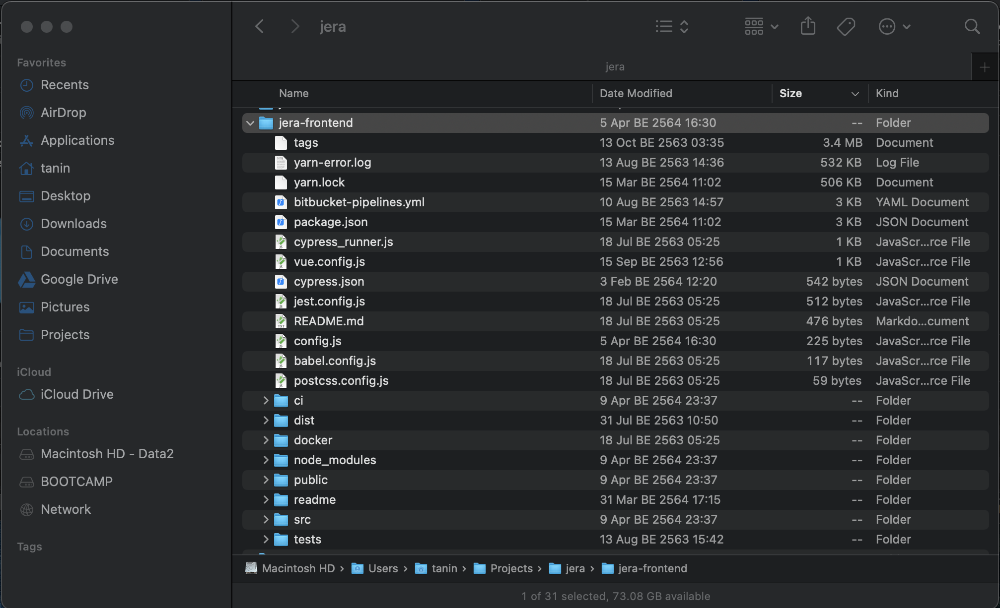
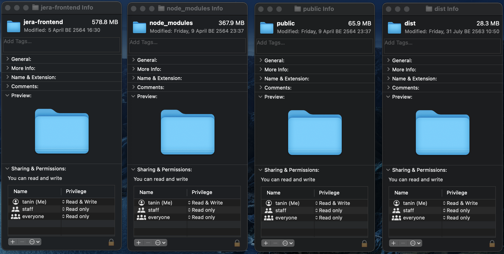
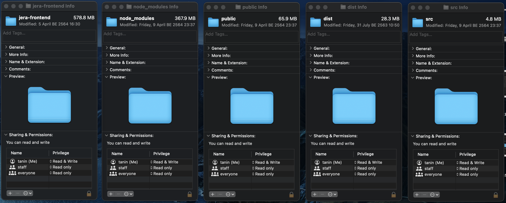

# Meeting 2021-04-11

ภาพรวมเทคโนโลยีการพัฒนาแอปในปัจจุบัน
-----------------------------
- Web Technology จากอดิต (ก็ไม่ไกลเท่าไร) ถึงปัจจุบัน
    - Server Side Rendering
    - Client Side Rendering
        - React, Angular, Vue
    - Back to Server Side Rendering
    - Web API
    - PWA
    - Electron.js
- Mobile
    - Native
    - Cross Platform
        - Flutter
        - React Native
        - View Web
- Programming Languages Tours
    - Compiled Language
        - Java
        - Go
        - .NET / C# ?
    - Interpreted Language
        - Python
        - Javascript / NodeJS
        - PHP
- Framework & Library
- Git + Github

ส่องว่า web ต่าง ๆ ใช้เทคโนโลยีอะไรกัน
-----------------------------
- [wappalyzer](https://chrome.google.com/webstore/detail/wappalyzer/gppongmhjkpfnbhagpmjfkannfbllamg?hl=en)
- [stackshare](https://stackshare.io/)

การเลือกภาษา, Technology Stack
----------------------------
- Popularity
- Leaning Curve ความยากในการเรียน
- ความเหมาะสมกับงาน
- ความเหมาะสมกับทีม
- Eco System
- Open Source License 

Software Development Cycle
--------------------------
- Agile https://youtu.be/D7n7-CP0suA
- Continuous Integration / Continuous Development
    - Automate Testing
    - Automate Deployment

Architectures & Scaling
-----------------------
- Horizontal Scaling VS Vertical Scaling
- Database Technology
    - SQL
    - NoSQL
    - In Memory Database
- Case Studies
    - Twitter case study (ข้อมูลหาง่าย เค้าชอบถามเป็น interview question)
- Monolitic
- Micro Services

System Down
-------------------------------
- System Monitoring
- Crash Report
 
 

# Keywords
- HTML, CSS, JS
- JSON
- API

<!-- ------------------------------------------------------------------------------------------- -->
# Web Technology

## Server Side Rendering

### Good
- Mature (Old)
- ทำง่าย
- Ready to use HTML

### Bad
- Server ทำหน้าที่สร้างไฟล์ HTML ให้กับทุก Request ที่เข้ามา
- ส่งข้อมูลเยอะ เพราะต้องส่งทั้งไฟล์ HTML ซึ่งอาจมีหลายพันบรรทัด 
- Website is not very interactive ทุกคร้้งที่มีการคลิกที่ลิ้งหน้าเว็บจะ reload

### Example Websites
- https://en.wikipedia.org
- https://www.thanapand.com/

### Todo
<input type="checkbox"> Demo when user enter url in browser's address bar  
<input type="checkbox"> Demo when someone call JSON API  

---

## Client Side Rendering
- React
- Angular
- Vuejs

### Good
- Highly Interactive Webpage
- ทำยากกว่านิดหน่อย แต่ระยะยาวจัดการง่ายกว่าในกรณีที่เป็น app ขนาดใหญ่
- Client เป็นฝ่าย render html
- Server ส่งข้อมูลไม่เยอะ ทำหน้าที่แค่ส่งข้อมูล JSON
- ไม่ต้องโหลดข้อมูลทั้งหมดในครั้งแรก

### Bad
- Not good with search engine (ไม่รู้ว่า google ปรับรึยัง?)
- Client เป็นฝ่าย render html

### Example Websites
- https://shopee.co.th
- https://google.com
- https://www.pinterest.com/

### Todo
<input type="checkbox"> Demo https://shopee.co.th  
<input type="checkbox"> Explain React vs JQuery  
<input type="checkbox"> Explain Jera V1 Payment Page  

---

## Back to Server Side Rendering

### Good
- Highly Interactive Webpage
- หน้าเว็บโหลดได้เร็วกว่า
- Server ส่งข้อมูลไม่เยอะ ทำหน้าที่แค่ส่งข้อมูล JSON
- ไม่ต้องโหลดข้อมูลทั้งหมดในครั้งแรก

### Bad
- Good with search engine
- ทำยากกว่า client side rendering

### Example Websites
- https://nextjs.org/
- https://www.lazada.co.th/

### Todo
<input type="checkbox"> Lazada VS Shopee 

---

## Web API 

Backend
- REST API = API ที่รอรับ HTTP Request

Frontend
- Web
- Mobile
- Desktop
- Bot?

---

## Progressive Web App (PWA)
[อ่านบทความ](https://timeff.medium.com/%E0%B9%82%E0%B8%AD%E0%B9%89%E0%B9%80%E0%B8%A2-progressive-web-app-%E0%B8%A1%E0%B8%B2%E0%B8%A5%E0%B8%AD%E0%B8%87%E0%B9%81%E0%B8%9A%E0%B8%9A%E0%B8%87%E0%B9%88%E0%B8%B2%E0%B8%A2%E0%B9%86-%E0%B8%A7%E0%B8%B1%E0%B8%99%E0%B9%80%E0%B8%94%E0%B8%B5%E0%B8%A2%E0%B8%A7%E0%B9%80%E0%B8%AA%E0%B8%A3%E0%B9%87%E0%B8%88-b7a2be52ae5b)

- เป็น web ที่เพิ่ม Manifest.json แล้วจะเพิ่มความสามารถ
- มี Icon อยู่ใน Mobile Home Screen
- Push Notification
- ใช้งาน Offline

---

## Electro.js
[อ่านบทความ](https://www.cleveroad.com/blog/electronjs-framework)

- Cross Platform Desktop App ใช้ได้ทั้ง Windows, Macs, Linux เขียนโค๊ดเดียวได้ 3 OS
- เขียนด้วย JavaScript (สามารถใช้ Web Technology ได้ React, Angular, Vue, ...)
- สามารถเข้าถึง Hardware & File System ได้
- ข้อเสียคือ ไฟล์มีขนาดใหญ่ และ แดก RAM (นึกถึง google chrome version พิเศษ)
- [ตัวอย่าง App ที่สร้างด้วย Electron.js](https://www.electronjs.org/)

<!-- ------------------------------------------------------------------------------------------- -->
# Mobile App

- Native
    - iOS ใช้ swift
    - Android ใช้ Java
- Cross Platform
    - Flutter
    - React Native
    - View Web

## Flutter

- By Google
- ใช้ภาษา Dart (ของ google เหมือนกัน)
- ลักษณะการเขียนคล้าย ๆ กับ React
- Single code base ใช้ได้ทั้ง iOS และ android
- Native performance เพราะว่า compile เป็น ARM machine code
- [Who's using flutter](https://flutter.dev/showcase)

---

## React Native

- By Facebook
- ใช้ภาษา JavaScript เขียน
- Not Native Performance
- [Who's using react native](https://reactnative.dev/showcase)
 
 

<!-- ------------------------------------------------------------------------------------------- -->
# Programming Languages Tours

แบ่งได้ 2 ประเภทหลัก 
- Compiled Language
    - Java
    - Go
    - .NET / C# ?
- Interpreted Language
    - Python
    - Javascript / NodeJS
    - PHP   

- [Compare Performance](https://benchmarksgame-team.pages.debian.net/benchmarksgame/index.html)
- [Compare Popularity](https://pypl.github.io/PYPL.html)
    - Check google trends
    - Try searching ... tutorial and see how many result
    - Check github page, and see how many stars it has
- [Who use what?](https://stackshare.io/) or just search who use ...
- [wappalyzer](https://chrome.google.com/webstore/detail/wappalyzer/gppongmhjkpfnbhagpmjfkannfbllamg?hl=en)

### Todo?
<input type="checkbox"> Guessing Game in Python?  
<input type="checkbox"> Guessing Game in Go?

<!-- ------------------------------------------------------------------------------------------- -->
# Framework & Library

> Don't reinvent the wheel

My Code VS Other People's Code

    
 เฉลย 

    

<!-- ------------------------------------------------------------------------------------------- -->
# Git + Github

> Git is 
- A Command Line Program
- A Distributed Version Control System  
- A Collaborate Tool

> Github is 
- Website
- Hub for code projects
- Now owned by microsoft

### Todo?
<input type="checkbox"> Github tour Flutter vs React Native  
<input type="checkbox"> Github tour React vs Vue vs Angular

<!-- ------------------------------------------------------------------------------------------- -->
# การเลือกภาษา, Technology Stack
- Owner
    - คุณภาพของโค๊ด
- Popularity
    - คุณภาพของโค๊ด
    - หาคนทำงานง่าย
    - มีคนเจอปัญหา, bug, error มาเยอะแล้ว
    - เวลาเราติดปัญหา หาคนถามง่ายกว่า
    - ไม่เลิกทำง่าย ๆ เจ้าของโปรเจ็คคอยพัฒนาต่อไปและแก้บัคให้
- Leaning Curve ความยากในการเรียน
- ความเหมาะสมกับงาน
- ความเหมาะสมกับทีม
- Eco System
- Open Source License 

# Software Development Cycle

## Agile 
Watch video: https://youtu.be/D7n7-CP0suA

## Testing & CI/CD

### Types of Testing
- Unit testing
- Integration testing
- End to end testing = Bot มาควบคุม browser แล้วทดสอบการทำงานของ Website ตาม Test Case
- Accecptance testing

### Analogy
- **Unit Testing**: During the process of manufacturing a ballpoint pen, the cap, the body, the tail, the ink cartridge and the ballpoint are produced separately and unit tested separately.
- **Integration Test**: During the process of manufacturing a ballpoint pen, the cap, the body, the tail and clip, the ink cartridge and the ballpoint are produced separately and unit tested separately. When two or more units are ready, they are assembled and Integration Testing is performed. For example, whether the cap fits into the body or not.
- **End to end Testing**: During the process of manufacturing a ballpoint pen, the cap, the body, the tail, the ink cartridge and the ballpoint are produced separately and unit tested separately. When two or more units are ready, they are assembled and Integration Testing is performed. When the complete pen is integrated, System Testing is performed.
- **Acceptance Testing**: During the process of manufacturing a ballpoint pen, the cap, the body, the tail and clip, the ink cartridge and the ballpoint are produced separately and unit tested separately. When two or more units are ready, they are assembled and Integration Testing is performed. When the complete pen is integrated, System Testing is performed. Once System Testing is complete, Acceptance Testing is performed so as to confirm that the ballpoint pen is ready to be made available to the end-users (students, poets, lovers, and so on).
 
 

<!-- ------------------------------------------------------------------------------------------- -->
# Architectures & Scaling

## Vertical vs Horizontal Scaling
- Vertical ใช้คอมแรงกว่าเดิม เพิ่ม CPU RAM HDD
- Horizontal ซื้อคอมใหม่มาช่วยตัวเก่าทำงาน

---

## Database Technology

### Relational Database (SQL)
- Store data in table format
- Strong database restriction เช่น อายุห้ามเป็น asdf
- Data Integration ให้ความสำคัญความถูกต้องของข้อมูล
- Nomalization ไม่เก็บ duplicate data
- Relation between table is defined by ForeignKey
- Vertical Scaling

### Example?  
Database Design restaurant review app
- Restaurant
- Review
- User

---

### NoSQL
- Store data in JSON object format
- No database restriction ทำให้สามารถ iterate database design ได้อย่างรวดเร็ว แต่ต้องเขียนโค๊ดแบบ defensive  
- Prioritize read operation over write opearation 
- Allow duplicate data
- Horizontal Scaling

### Example?  
Database Design restaurant review app
- Restaurant
- Review
- User

---

### In Memory Database (Redis)
- Store value in key-value format
- Very fast because the data is stored in RAM

---

### Twitter Case Study
ref https://youtu.be/KmAyPUv9gOY

Features
- Sending tweet
- User timeline: user see your own tweet and your re-tweet
- Home timeline: user see all tweet from people that he follow, sort by datetime
- Following

Use Relational Database
- User Table
- Tweet Table
- Following Table

Problems
- Tweet Table will get huge
- Twitter have multiple thousands request a second for the home page

Solutions
- Pre-compute home page and store in redis

Edge Case
- What if someone has 10,000,000 followers
---

## Monolitic

### **Example** Shopee clone # 1
HTML Server side rendering  
- Single Server
- 

### **Example** Shopee clone # 2 
- Backend: API server  
- Frontend: Client side rendering with react

## Micro Services

### **Example** Shopee clone # 3
Backend:  
- Authentication Service
- Product Listing Service
- Shopping Cart Service
- Payment Service  

Frontend: Client side rendering with react

# System Down
- System Monitoring
- Crash Report